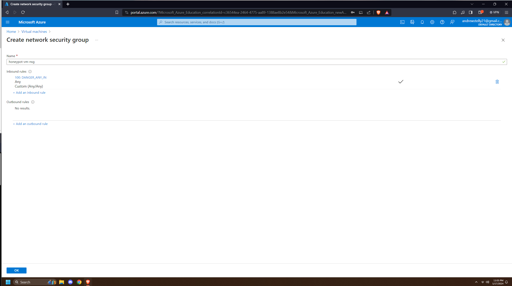
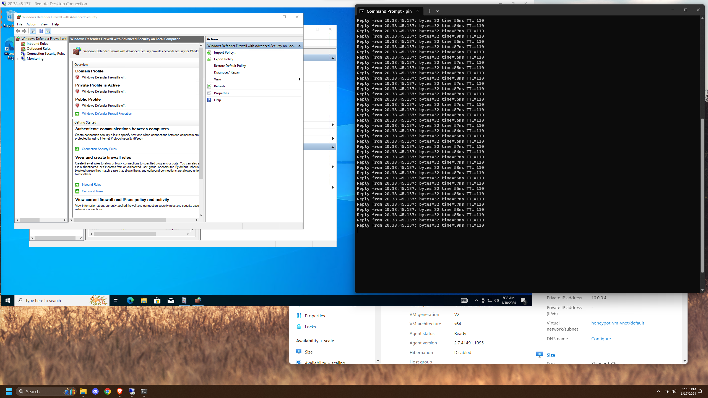
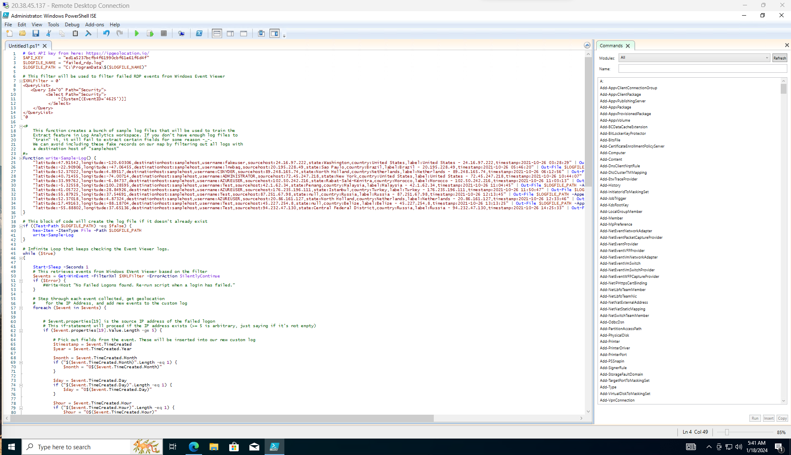
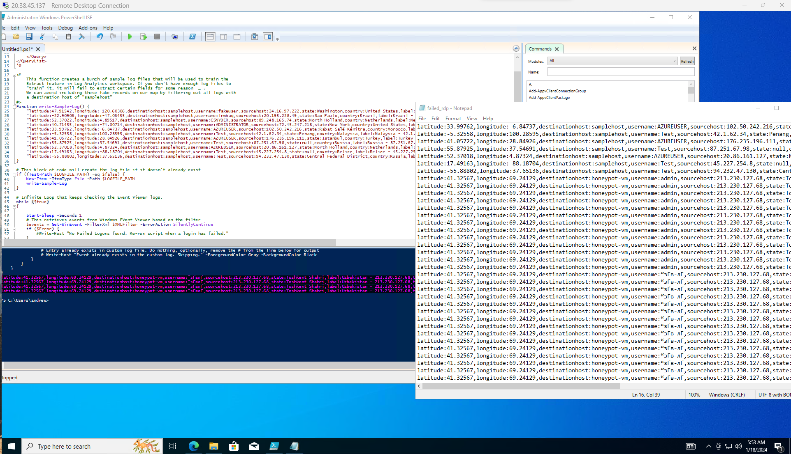

# SIEM Honeypot Lab

## Description  
I set up Azure Sentinel (SIEM) and connected it to a live virtual machine acting as a honeypot. I observed real-time brute-force RDP attacks from around the world. A custom PowerShell script collected geolocation data of attackers and plotted it on the Azure Sentinel Map.

---

## Languages and Utilities Used
- **PowerShell**  
- **Azure**

## Environments Used
- **Windows 10**

---

## Program Walkthrough

Create a virtual machine through Microsoft Azure with an open firewall  
 

  
  

After creating the VM, disable the firewall and ensure ICMP Echo requests work (pingable)  
 

  

Run a PowerShell script to log geolocation data of login attempts  
 

  

Verify logs are being written correctly  
 

  

Observe attempts in the Windows Event Log (Security log)  
 

  

View usernames being targeted, most often 'administrator'  
 

  

Use Azure Monitor to capture failed login attempts  
 

  

Visualize attacker geolocation data in Microsoft Sentinel  
 

  

Final attack map showing global brute-force RDP attempts  
 

